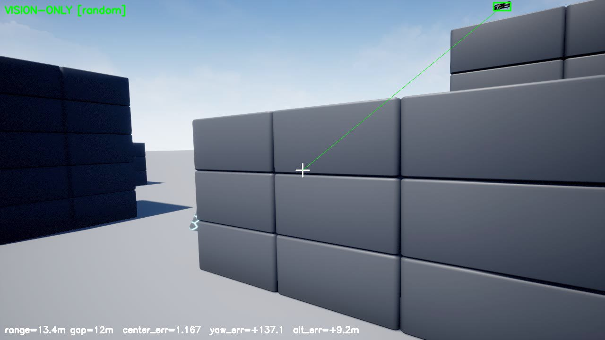
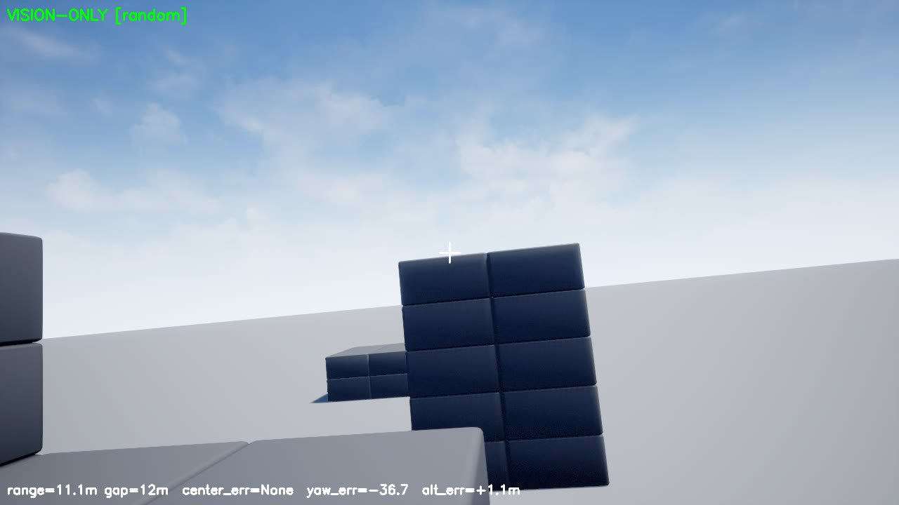
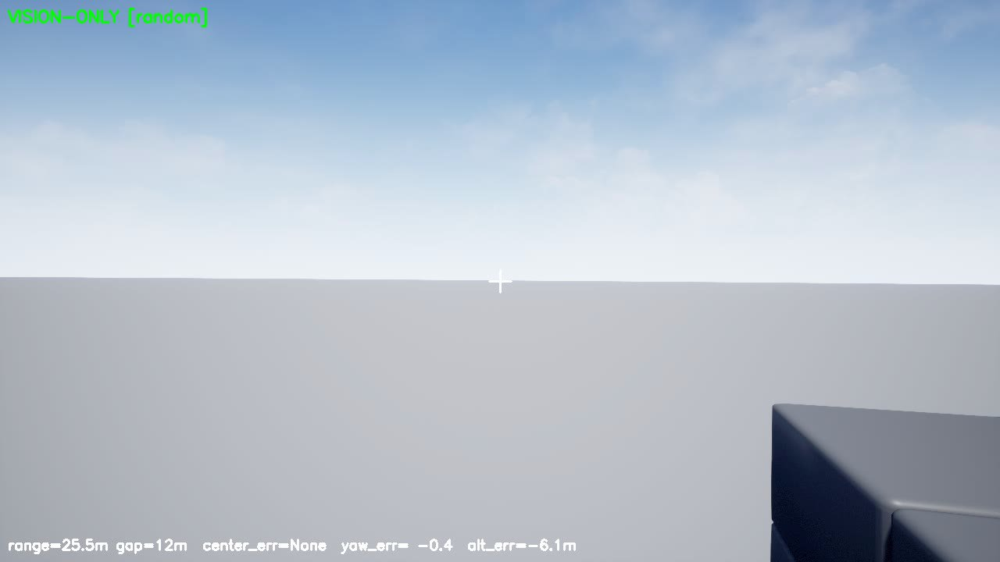

# third_iris — air-to-air UAV tracking + GPS-denied (VIO) navigation

**A simulated chaser drone that visually detects, locks onto, and follows another drone — and keeps
tracking it even when GPS is jammed.** Built on AirSim with YOLO26-seg + BoT-SORT perception, a
standoff guidance law, depth-based obstacle avoidance, and a camera+IMU **Visual-Inertial Odometry**
fallback, all driven from a browser **Web UI**.

> Operational concept: **GPS + telemetry available** → click a target and follow it with GPS-aided
> guidance. **GPS jammed** → the onboard computer self-localizes with VIO and holds the lock with a
> drift-immune visual servo. Select target → set gap/speed → it flies the standoff and holds it.



---

## Highlights

| Capability | What it does |
|---|---|
| **Air-to-air detection + segmentation** | Fine-tuned **YOLO26-seg** (single class `drone`, mAP50 0.97) on AirSim-generated data. |
| **Tracking** | **BoT-SORT + ReID + camera-motion compensation** (default) / ByteTrack — handles the moving FPV camera. |
| **Standoff guidance** | Full N/E/D velocity = position-P **+ target-velocity feed-forward**, absolute lead yaw → flies *alongside*, holds a configurable gap, climbs/descends to match the target. No spin, speed-matched. |
| **Obstacle avoidance** | Depth used as a **LiDAR-like** sensor — APF (attractive target + tangential repulsion) blended by time-to-collision; brakes/steers around buildings without dropping the lock. |
| **GPS-denied VIO** | **RGB-D + IMU** self-localization (`vio/vio_estimator.py`); GPS-available → primed/anchored, GPS-jammed → free-runs while a body-frame visual servo holds the target. |
| **Web UI** | Live video + click-to-lock + telemetry; gap/speed/mode, obstacle-avoidance & GPS-jam toggles, and **link-protocol selectors** (video: RTSP/UDP/HTTP/device/file; telemetry: MAVLink serial/UDP/TCP). |

 

---

## Measured results (AirSim, vs. ground truth)

| Scenario | Result |
|---|---|
| Random target (gap 12 m) | target **in-frame 84%**, gap held, climbs/descends; roll rms 2.3°, smooth |
| Orbit (lateral crossing) | centering error **0.135**, **no spin** |
| Obstacle avoidance | 0 false triggers in open air, does not brake for the (small) target |
| **VIO drift (GPS jammed 22 s / 38 m)** | **98% VO success, ~4.5 m drift** (bounded, not divergence) |
| **GPS-jammed tracking** | **9/11 frames tracked over ~30 s**, gap held 9–16 m, centered |
| **GPS-denied waypoint nav** (VIO only, ~56 m square) | reaches every waypoint; **mean error 4.4 m** with magnetometer yaw-aid (20.6 m / diverges without it) |

---

## Quickstart — Web UI

```powershell
# 0. one-time env (Blackwell cu128 torch + ultralytics + flask + open3d)
powershell -ExecutionPolicy Bypass -File env\setup_windows.ps1

# 1. launch AirSim (Blocks) and wait until it is running
sim\airsim\Blocks\WindowsNoEditor\Blocks.exe

# 2. start the Web UI
.\.venv\Scripts\Activate.ps1
python webui\app.py            # then open http://localhost:5000
```

Click a detected drone to **lock** it, set the **gap** (0–50 m) and **max speed**, pick a **guidance
mode**, and watch it fly the standoff. Tick **"Simulate GPS jamming"** to see it keep tracking on VIO.

> AirSim reads `settings.json` from the OneDrive Documents path on this machine — see
> [docs/GOTCHAS.md](docs/GOTCHAS.md).

---

## The GUI

A single browser page (`webui/templates/index.html`, served by `webui/app.py`):

- **Live video (click-to-lock):** YOLO detections (green = locked + centering line; amber = other
  candidates), center reticle, last-5 s target trail, depth thumbnail, and status banners
  (`DETECT` / `TRACK`, plus amber **GPS-JAMMED — VIO NAV** and red **AVOID OBSTACLE** overlays).
- **Telemetry:** state, lock, target ID, confidence, range, gap, altitude, centering error, pointing
  error, detections, vision rate, FPS, **navigation source (GPS/VIO)**, VIO drift, obstacle
  clearance, camera mode, and the active video/telemetry sources.
- **Controls:** gap slider, max-speed slider, guidance-mode dropdown
  (`fused` / `vision_after_arrival` / `vision` / `location`), obstacle-avoidance toggle, **GPS-jam
  toggle**, Clear Lock, Land.
- **Sources (link protocol):** video receiver (AirSim / RTSP / UDP / HTTP / device / file) and
  telemetry receiver (AirSim / MAVLink serial / UDP / TCP), each with an endpoint + Apply — so the
  same UI drives a real video + telemetry downlink, not just the sim.

Full reference: [docs/WEBUI.md](docs/WEBUI.md).

---

## Documentation

| Doc | Contents |
|-----|----------|
| [docs/ARCHITECTURE.md](docs/ARCHITECTURE.md) | Full pipeline, data flow, coordinate frames. |
| [docs/GUIDANCE.md](docs/GUIDANCE.md) | Standoff follow law, steadiness, obstacle avoidance, camera mode, scenario tester + results. |
| [docs/VIO.md](docs/VIO.md) | GPS-denied self-localization: RGB-D + IMU VIO, dual-mode, body-frame visual servo, drift results. |
| [docs/RESEARCH.md](docs/RESEARCH.md) | Papers + **reuse-vs-build** decisions (tracking / VIO / avoidance). |
| [docs/DEPLOYMENT.md](docs/DEPLOYMENT.md) | **Real-world deployment roadmap**: sim-vs-real, hardware BOM, reuse (VINS/OpenVINS → PX4 EKF2), integration, phased plan + effort. |
| [docs/WEBUI.md](docs/WEBUI.md) | Web UI: controls, telemetry, overlays, HTTP API. |
| [docs/DATASET_AND_TRAINING.md](docs/DATASET_AND_TRAINING.md) | AirSim auto-labeled dataset + YOLO26-seg training. |
| [docs/GOTCHAS.md](docs/GOTCHAS.md) | Troubleshooting & hard-won lessons. |

---

## Built on (reused, not reinvented)

YOLO26-seg + BoT-SORT/ByteTrack (Ultralytics) · AirSim / Cosys-AirSim · Open3D RGB-D odometry ·
OpenCV (LK / Umeyama) · PX4 / MAVSDK / pymavlink · APF/VFH avoidance. Heavyweight GPS-denied flight
path (OpenVINS → PX4 EKF2 in WSL2/ROS2) is documented in [vio/README.md](vio/README.md). See
[docs/RESEARCH.md](docs/RESEARCH.md) for citations.

## Repo layout

```
webui/        Web UI (Flask): app.py, sources.py (video/telemetry protocols), templates/index.html
sim/airsim/   guidance.py (standoff law) · avoidance.py (depth obstacle avoidance) ·
              scenario_eval.py (tester/recorder) · trajectories.py · smooth_control.py
vio/          vio_estimator.py (RGB-D+IMU VIO) · vio_test.py (drift test) · gt_pose_bridge/ · README.md
perception/   YOLO26 detect/segment + trackers (botsort_uav.yaml, bytetrack_uav.yaml) + train/eval
datasets/     AirSim auto-labeling + conversion
px4_config/   EKF2 external-vision params
env/          Windows + WSL2 setup scripts
```

## Limitations (honest)
- VIO **yaw drifts** without a magnetometer (bounded over tens of seconds); long jams need a mag aid.
- Open3D VO backend is integrated but **experimental** (default is the validated Umeyama+RANSAC path).
- Active **gimbal** is opt-in/experimental (`simSetCameraPose` unreliable in the test build); default
  is FPV (body-fixed) tracking.
- The full OpenVINS→EKF2 GPS-denied *flight* stack is documented, not yet wired (needs WSL2/ROS2).

🤖 Built with [Claude Code](https://claude.com/claude-code)
